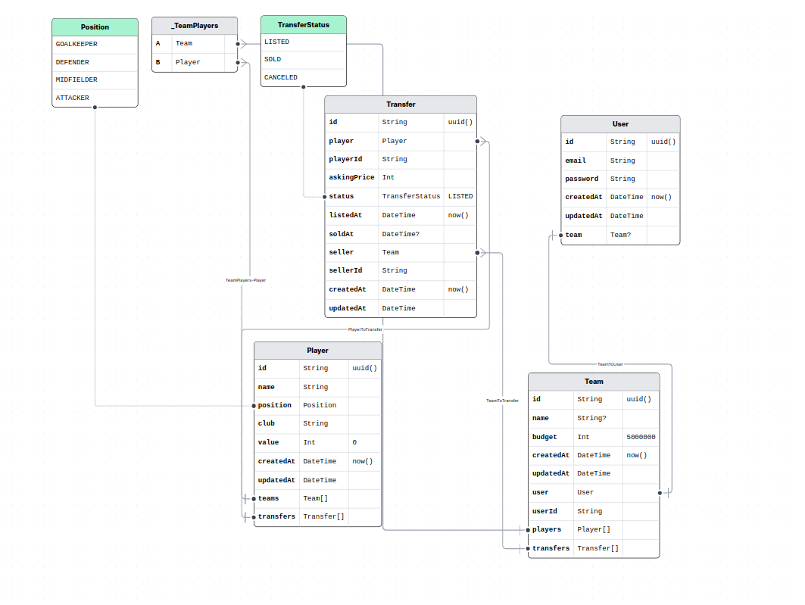

# Fantasy Manager Web Application

## Important Links and Info

- [Video Demo]()

<!-- TABLE OF CONTENTS -->

# 📗 Table of Contents

- [📖 About the Project](#about-project)
  - [🛠 Built With](#built-with)
    - [Tech Stack](#tech-stack)
- [💻 Getting Started](#getting-started)
  - [Setup](#setup)
  - [Prerequisites](#prerequisites)
  - [Install](#install)
  - [Usage](#usage)
- [ DataBase Design](#database-design)
- 🕙 [Time report](#Time-Report)
- 📈 [Areas for Improvement](#improvements)
- [👥 Authors](#authors)
- [📝 License](#license)

<!-- PROJECT DESCRIPTION -->

# 📖 Fantasy Manager <a name="about-project"></a>

**Fantasy Manager** Fantasy Manager App is a React web application that allows users to buy and sell players through a player transfer system.

## 🛠 Built With <a name="built-with"></a>

### Tech Stack <a name="tech-stack"></a>

<details>
  <summary>Client</summary>
  <ul>
    <li><a href="https://reactjs.org/">React</a></li>
    <li><a href="https://redux.js.org/">Redux</a></li>
  </ul>
</details>

<details>
<summary>Backend</summary>
  <ul>
    <li><a href="https://nodejs.org/en">Node.js</a></li>
    <li><a href="https://expressjs.com/">Express.js</a></li>
  </ul>
</details>

<details>
<summary>Database</summary>
  <ul>
    <li><a href="https://www.postgresql.org/">PostgreSQL</a></li>
    <li><a href="https://www.prisma.io/">Prisma.js (As Database ORM)</a></li>
  </ul>
</details>
<details>
<summary>Package Manager</summary>
  <ul>
    <li><a href="https://pnpm.io/">PNPM</a></li>
  </ul>
</details>
<details>
<summary>Technologies</summary>
  <ul>
    <li><a href="https://expressjs.com/">Express.js</a></li>
    <li><a href="https://redux-toolkit.js.org/rtk-query/overview">RTK Query</a></li>
    <li><a href="https://developer.mozilla.org/en-US/docs/Web/API/WebSockets_API">WebSockets</a></li>
    <li><a href="https://docs.bullmq.io/">Bull MQ</a></li>
    <li><a href="https://www.docker.com/">Docker (optional)</a></li>
  </ul>
</details>


<!-- DATABASE Design -->

## 💁 DataBase Design <a name="database-design"></a>




<!-- GETTING STARTED -->

## 💻 Getting Started <a name="getting-started"></a>

To get a local copy up and running, follow these steps.

### Prerequisites

In order to run this project locally you need:

- Node js --version *v22.11.0*
- PNPM package manager
- <details>
    <summary>Database (you can run container for it as following)</summary>
    <ul>
    
    ```sh
         docker run --name my-postgres-container \
        -e POSTGRES_USER=postgres \
        -e POSTGRES_PASSWORD=postgres \
        -p 5432:5432 \
        -d postgres
    ```
    </ul>
    </details>
- <details>
    <summary>Redis (you can run a container for it as following)</summary>
    <ul>
    
    ```sh
         docker run --name my-redis-container \
        -p 6379:6379 \
        -d redis
    ```
    </ul>
</details>


### Setup

- **Clone this repository to your desired folder:**

```sh
  cd my-folder
  git clone https://github.com/KareemMWilson/fantasy-manager.git
```

----------------------------
### Install

- **Install this project with:**

```sh
  cd fantasy-manager/backend
  pnpm install


  cd ../frontend
  pnpm install
```
**NOTE:** *'Make sure that you are using node *v22.11.0*'*

- **Add `.env` file**

**NOTE:** *'I didn't push it into version control for security best practises, but you can find .example.env file in backend and use it, but make sure that you run docker commands in Prerequisites section'*

**So, In backend Dir:**
Create `.env` file using .example.env file , It will work

```sh
  mv .example.env .env
```


- **Seed database:** 

```sh
  npx prisma generate &&
  pnpm run seed
```

*This Command seed database with players*

--------------------------
### Usage

- **To run the project, execute the following command in both Directories (backend/ & frontend/):**

```sh
  pnpm dev
```

**OR**
- Using docker-compose without doing anything after cloning repo
```sh
  docker-compose up --build
```
<!-- AUTHORS -->


## 🕙 Time Report  <a name="time-report"></a>

| **Section**          | **Description**                                                                     | **Time Spent** |
|-----------------------|-------------------------------------------------------------------------------------|----------------|
| **Setup**            | Setting up the project, Understanding the requirements initializing the repository, and configuring dependencies.  | 1 Day       |
| **DataBase Design** | Trying to design a flexable db for future features and updates                          | 7 Hours       |
| **User Authentication** | Implementing the Authentication flow using email and password.                      | 3 Hours       |
| **Team Creation**    | Developing the background process for creating teams with budget and players.          | 24 Hours       |
| **Transfer Market**  | Building functionality for filtering transfers, adding/removing players, and transactions. | 18 Hours       |
| **Frontend Development** | Designing and implementing the user interface using React and the chosen UI framework. |  In Parallel takes all 7 days      |
| **Testing**          | Conducting tests to ensure proper functionality and addressing any bugs.               | In Parallel       |
| **Documentation**    | Writing the README file and providing clear setup and usage instructions.              | 5 Hours       |
| **Other Tasks**      | Miscellaneous tasks, refactoring, or final touches.                                    | 6 Hours       |


## 🛠 Areas for Improvement

- ### UI:

    - **useDebounce:** Implementing debouncing for search inputs to prevent sending queries as the user types, enhancing both performance and user experience.

    - **Load onScroll:** Leveraging an Intersection Observer to load data on scroll instead of fetching all data at once.

    - **Empty State:** Designing empty screens to inform users when no data is available, improving both user experience and performance.

- ### Backend: 

    - **Testing:** Writing unit tests for logic in services to avoid retesting manually after every change. 

    - **Middleware:** Utilizing additional middlewares, such as input validation for all endpoints. 

    - **Error Handling:** Enhancing error handling by adding a dedicated middleware.

- ### Real Time connection:
    - Currently, the connection is closed after the team is created and fetched. However, the socket could remain open for the entire session to support additional features, such as a notification system. The current implementation has been designed with this potential feature in mind, making it easier to extend for future enhancements.


## 👥 Authors <a name="authors"></a>

👤 **Kareem Wilson**

- Main GitHub: [Kareem Wilson](https://github.com/KareemWilson)
- LinkedIn: [Kareem Wilson](https://linkedin.com/in/kareem-wilson)


<!-- LICENSE -->

## 📝 License <a name="license"></a>

This project is [MIT](./LICENSE) licensed.